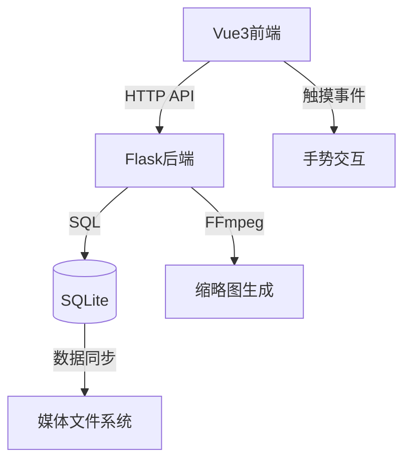

# 🚀 Mocaca 智能视频管理平台

<div align="center">
  
  
  
</div>

## ✨ 核心特色功能

### 🎯 智能视频播放体验
- **长按2倍速播放**  
  👆 长按视频区域即可2倍速播放，释放手指恢复原速
- **滑动进度控制**  
  ↔️ 水平滑动快进/快退，↕️ 垂直滑动切换视频
- **绿色闪电裂痕心形图标**  
  💚 讨厌功能，配合讨厌一键批量删除功能，实现批量清理不需要的视频文件

### 🔄 智能播放列表管理
- **多源视频导航**  
  📱 支持从收藏列表、发现页面、播放列表等多种来源进入播放器
- **上下文保持导航**  
  🔄 播放过程中保持来源页面上下文，返回时智能跳转
- **自动连续播放**  
  ▶️ 视频播放结束后自动播放下一个，无需手动操作

### ❤️ 个性化交互功能
- **收藏管理**  
  ⭐ 支持视频收藏功能，创建个人专属播放列表
- **情感反馈**  
  💔 独特的"讨厌"功能，提供情感化交互体验
- **用户状态同步**  
  🔄 实时同步收藏和讨厌状态，支持多用户环境

### 🎮 高级播放控制
- **智能手势识别**  
  👌 精确识别长按、滑动等多种手势操作
- **实时进度预览**  
  ⏱️ 滑动快进时显示实时时间进度和快进量
- **无缝视频切换**  
  🔄 流畅的滑动切换动画，支持上下方向导航

### 🛡️ 用户体验优化
- **阻止下载菜单**  
  🚫 智能阻止视频长按下载菜单弹出
- **自动播放优化**  
  🔄 智能处理浏览器自动播放策略
- **加载状态管理**  
  ⏳ 完善的加载状态指示和错误处理

### 📺 媒体管理功能
- **自动缩略图生成**  
  🖼️ FFmpeg自动处理视频缩略图，提升浏览体验。当前为实时生成，不会强行扫库。后续考虑半夜扫库生成。
- **文件系统监控**  
  📁 实时同步媒体文件变化，自动更新播放列表
- **多格式视频支持**  
  🎬 主流视频格式兼容播放，无需格式转换

### 🚀 部署运维特性
- **多架构容器支持**  
  🐳 ARM和x86架构完整支持，跨平台部署无忧
- **一键容器化部署**  
  ⚡ Docker一键部署，环境隔离，配置简单
- **持续集成发布**  
  🔄 GitHub Actions自动化构建发布，版本管理规范

### 🛠️ 技术架构


## 🚀 快速开始

### 开发环境运行
```bash
# 启动前端开发服务器
cd frontend && npm run dev

# 启动后端服务
cd backend && flask run
```

### 🐳 Docker 部署

#### 生产环境配置（使用DockerHub镜像）
```yaml
version: "3.8"
services:
  mocaca-backend:
    image: aidedaijiayang/mocaca-backend:latest
    container_name: mocaca-backend
    ports:
      - 5003:5003
    volumes:
      # 数据库文件位置
      - ./data:/app/instance
      # 缩略图位置
      - ./pic:/app/thumbnails
      # 媒体位置，多磁盘目录，可以映射到media子目录
      - ./media:/app/media
    environment:
      - PUID=1000
      - PGID=100
      - TZ=Asia/Shanghai
      - MEDIA_FOLDER=/app/media
      - THUMBNAIL_FOLDER=/app/thumbnails
    networks:
      - mocaca-network
    restart: unless-stopped
  mocaca-frontend:
    image: aidedaijiayang/mocaca-frontend:latest
    container_name: mocaca-frontend
    ports:
      - 5173:80
    depends_on:
      - mocaca-backend
    networks:
      - mocaca-network
    restart: unless-stopped
networks:
  mocaca-network:
    driver: bridge
```

#### 部署命令
```bash
# 开发环境构建部署
docker-compose up -d --build

# 生产环境使用镜像部署（推荐）
docker-compose -f docker-compose.prod.yml up -d

# 多架构镜像构建（支持ARM/X86）
./build-multiarch-images.sh

# 推送到DockerHub
./publish-dockerhub.sh
```

## 📌 设计理念

1. **用户为中心**  
   专注于提供直观、自然的视频交互体验

2. **简洁高效**  
   去除复杂操作，让视频观看回归纯粹

3. **技术实用**  
   选择成熟稳定的技术栈，确保系统可靠性

4. **持续迭代**  
   基于用户反馈不断优化功能和体验
