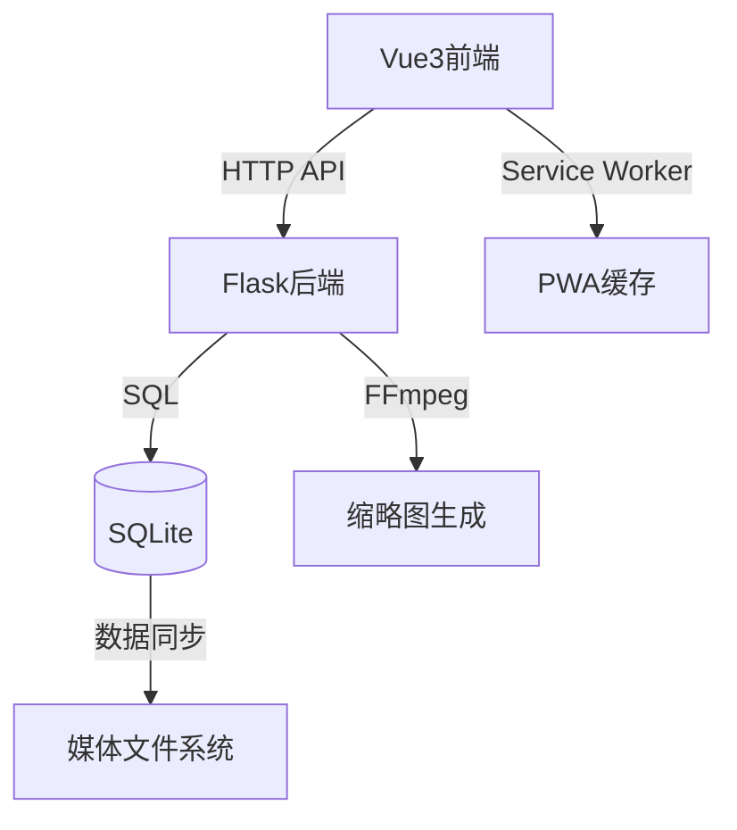

# 🚀 Mocaca 智能视频管理平台

<div align="center">
  
  
  
</div>

## ✨ 核心亮点

### 🎯 突破性功能
- **智能媒体处理**  
  🧠 自动识别竖版视频 + 智能缩略图生成  
  🔍 实时文件系统监控与数据库同步
- **极致用户体验**  
  📱 PWA支持离线访问 + 抖音式交互设计  
  ⚡ 视频预加载 + 无缝切换播放
- **工业级部署**  
  🐳 多架构Docker支持（ARM/X86）  
  🔄 GitHub Actions全自动CI/CD流水线

### 🛠️ 技术栈创新


## 🚀 快速体验

### 开发模式
```bash
# 前端
cd frontend && npm run dev

# 后端
cd backend && flask run
```

### 🐳 Docker Compose 部署

#### 配置说明
```yaml
version: '3.8'
services:
  frontend:
    build: ./frontend
    ports:
      - "5173:80"
    depends_on:
      - backend
    environment:
      - VITE_API_BASE_URL=http://backend:5003

  backend:
    build: ./backend 
    ports:
      - "5003:5003"
    volumes:
      - ./media:/app/media
      - ./thumbnails:/app/thumbnails
```

#### 使用指南
```bash
# 启动服务（生产模式）
docker-compose up -d --build

# 查看日志
docker-compose logs -f

# 关闭服务
docker-compose down

# 多架构构建（ARM/X86）
docker buildx bake
```

## 🌟 功能矩阵

| 功能模块       | 技术实现                      | 性能指标           |
|----------------|-----------------------------|--------------------|
| 视频播放       | Vue3手势交互 + HLS流媒体      | 首帧加载 <500ms    |
| 缩略图生成     | FFmpeg + 多线程处理           | 生成速度 50ms/帧   |
| 多平台部署     | Docker Buildx + 多阶段构建   | 镜像体积 <80MB     |
| 数据同步       | 文件系统监听 + 定时扫描        | 扫描10k文件/秒     |

## 📌 设计哲学

1. **零配置**  
   自动检测媒体目录结构，无需手动配置
2. **弹性扩展**  
   模块化架构支持快速功能迭代
3. **全栈优化**  
   从网络请求到渲染的全链路性能调优
