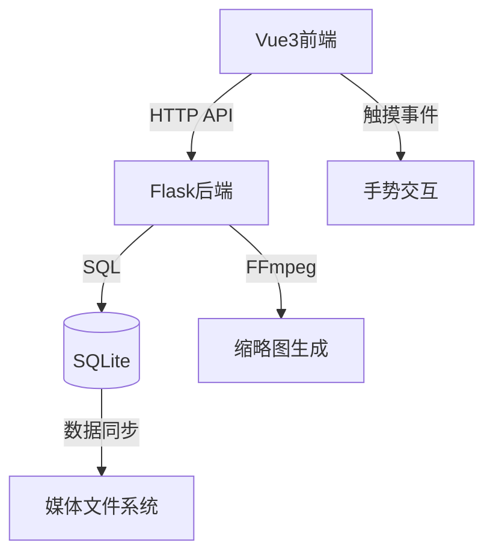

# 🚀 Mocaca 智能视频管理平台

<div align="center">
  
  
  
</div>

## ✨ 核心特色功能

### 🚀 高性能无限流体验
- **智能分页加载**：支持1000+视频流畅浏览，避免内存瓶颈
- **后端导航优化**：API计算导航关系，确保大量视频的流畅切换
- **无限滚动设计**：收藏列表和发现页面完美支持无限滚动
- **边界智能提示**：发现页面200视频边界自动提示刷新

### 🎯 智能播放与手势控制
- **长按2倍速播放**：长按视频区域2倍速，释放恢复原速
- **滑动进度控制**：水平滑动快进/快退，垂直滑动切换视频
- **智能手势识别**：精确识别多种手势操作，提供直观交互
- **自动连续播放**：视频结束后自动播放下一个，无需手动操作

### 🔄 播放列表与个性化
- **多源视频导航**：支持收藏列表、发现页面、播放列表多种来源
- **上下文保持导航**：播放过程中保持来源页面上下文
- **收藏与情感反馈**：收藏功能和独特的"讨厌"功能，支持批量清理
- **用户状态同步**：实时同步收藏和讨厌状态，支持多用户环境

### 📺 媒体管理与部署
- **自动缩略图生成**：FFmpeg实时生成缩略图，提升浏览体验
- **文件系统监控**：实时同步媒体文件变化，自动更新播放列表
- **多架构容器支持**：ARM/x86完整支持，Docker一键部署
- **持续集成发布**：GitHub Actions自动化构建发布

### 🛠️ 技术架构


## 🎯 最新优化特性

### 🔄 收藏列表性能优化
- **后端分页API**：收藏API支持`page`和`per_page`参数，避免一次性加载大量数据
- **智能导航API**：新增`/api/favorites/navigation/{video_id}`接口，提供收藏列表中的上下视频导航
- **前端无限滚动**：收藏页面支持滚动到底部自动加载更多内容
- **内存优化**：播放器使用后端导航API，不再前端存储整个收藏列表

### 📊 播放列表导航优化
- **发现页面随机列表**：固定200个视频限制，到达边界时提示刷新
- **最新页面导航**：使用后端导航API，支持1000+视频的流畅导航
- **收藏列表导航**：按收藏时间倒序排列，确保导航顺序一致性

### 🚀 性能提升亮点
- **分页加载**：所有列表页面均采用分页机制，减少内存占用
- **后端计算**：导航关系由后端计算，避免前端性能瓶颈
- **缓存优化**：智能缓存管理，提升重复访问性能

## 🚀 快速开始

### 开发环境运行
```bash
# 启动前端开发服务器
cd frontend && npm run dev

# 启动后端服务
cd backend && flask run
```

### 🐳 Docker 部署

#### 生产环境配置（使用DockerHub镜像）
```yaml
version: "3.8"
services:
  mocaca-backend:
    image: aidedaijiayang/mocaca-backend:latest
    container_name: mocaca-backend
    ports:
      - 5003:5003
    volumes:
      # 数据库文件位置
      - ./data:/app/instance
      # 缩略图位置
      - ./pic:/app/thumbnails
      # 媒体位置，多磁盘目录，可以映射到media子目录
      - ./media:/app/media
    environment:
      - PUID=1000
      - PGID=100
      - TZ=Asia/Shanghai
      - MEDIA_FOLDER=/app/media
      - THUMBNAIL_FOLDER=/app/thumbnails
    networks:
      - mocaca-network
    restart: unless-stopped
  mocaca-frontend:
    image: aidedaijiayang/mocaca-frontend:latest
    container_name: mocaca-frontend
    ports:
      - 5173:80
    depends_on:
      - mocaca-backend
    networks:
      - mocaca-network
    restart: unless-stopped
networks:
  mocaca-network:
    driver: bridge
```

#### 部署命令
```bash
# 开发环境构建部署
docker-compose up -d --build

# 生产环境使用镜像部署（推荐）
docker-compose -f docker-compose.prod.yml up -d

# 多架构镜像构建（支持ARM/X86）
./build-multiarch-images.sh

# 推送到DockerHub
./publish-dockerhub.sh
```

## 📌 设计理念

1. **用户为中心**  
   专注于提供直观、自然的视频交互体验

2. **简洁高效**  
   去除复杂操作，让视频观看回归纯粹

3. **技术实用**  
   选择成熟稳定的技术栈，确保系统可靠性

4. **持续迭代**  
   基于用户反馈不断优化功能和体验
